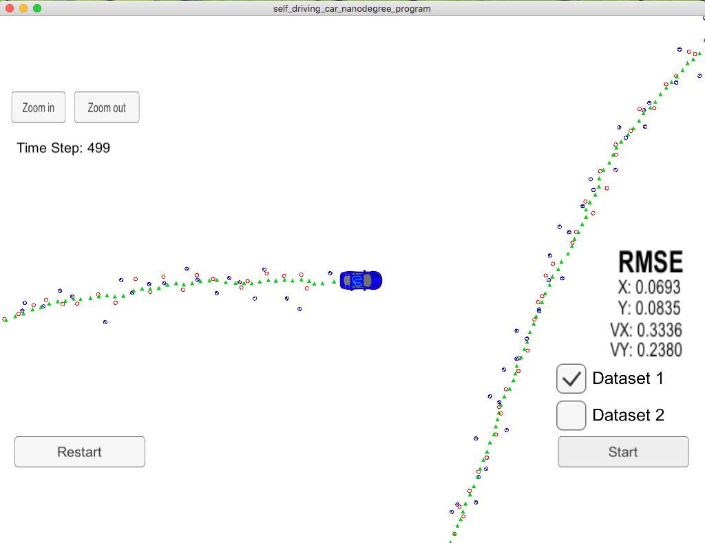
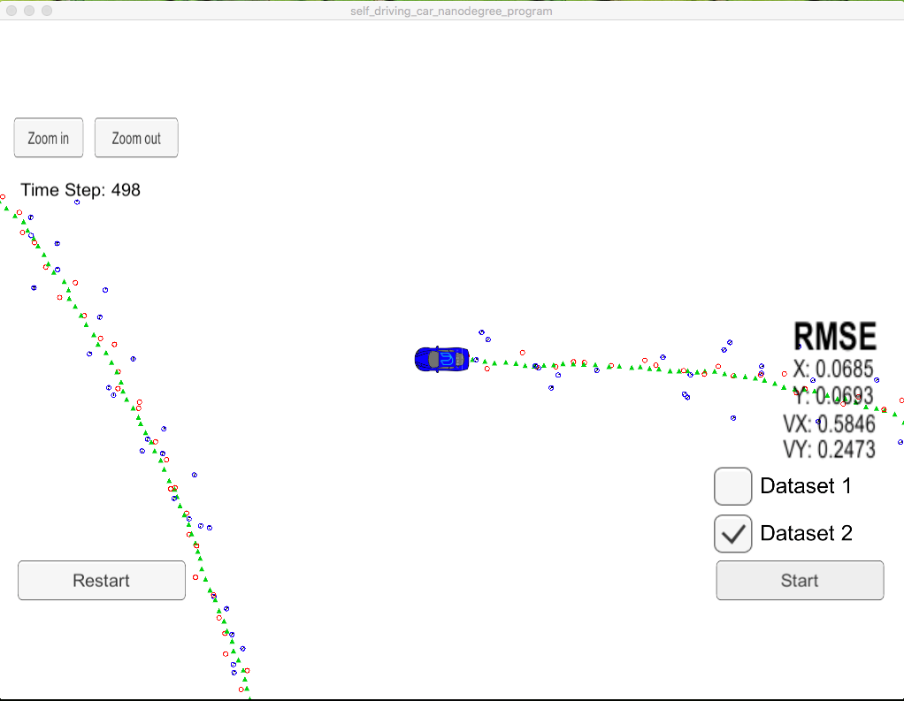

# CarND-Unscented-Kalman-Filter-P2
Udacity Self-Driving Car Nanodegree - Unscented Kalman Filter Implementation

# Overview

This project consists of implementing an [Unscented Kalman Filter](https://en.wikipedia.org/wiki/Kalman_filter#Unscented_Kalman_filter) with C++. A simulator provided by Udacity ([it could be downloaded here](https://github.com/udacity/self-driving-car-sim/releases)) generates noisy RADAR and LIDAR measurements of the position and velocity of an object, and the Unscented Kalman Filter[UKF] must fusion those measurements to predict the position of the object. The communication between the simulator and the UKF is done using [WebSocket](https://en.wikipedia.org/wiki/WebSocket) using the [uWebSockets](https://github.com/uNetworking/uWebSockets) implementation on the UKF side. To get this project started, Udacity provides a seed project that could be found [here](https://github.com/udacity/CarND-Unscented-Kalman-Filter-Project).

# Prerequisites

The project has the following dependencies (from Udacity's seed project):

- cmake >= 3.5
- make >= 4.1
- gcc/g++ >= 5.4
- Udacity's simulator.

For instructions on how to install these components on different operating systems, please, visit [Udacity's seed project](https://github.com/udacity/CarND-Unscented-Kalman-Filter-Project). As this particular implementation was done on Mac OS, the rest of this documentation will be focused on Mac OS. I am sorry to be that restrictive.

In order to install the necessary libraries, use the [install-mac.sh](./install-mac.sh).

# Compiling and executing the project

These are the suggested steps:

- Clone the repo and cd to it on a Terminal.
- Create the build directory: `mkdir build`
- `cd build`
- `cmake ..`
- `make`: This will create two executable `UnscentedKF` containing implementation.

## Running the Filter

From the build directory, execute `./UnscentedKF`. The output should be:

```
Listening to port 4567
Connected!!!
```

As you can see, the simulator connect to it right away.

The following is an image of the simulator:


The simulator provides two datasets. The differences between them are:

- The direction the car (the object) is moving.
- The order the first measurement is sent to the UKF. On dataset 1, the LIDAR measurement is sent first. On the dataset 2, the RADAR measurement is sent first.

Here is the simulator final state after running the EKL with dataset 1:



Here is the simulator final state after running the EKL with dataset 2:



# [Rubric](https://review.udacity.com/#!/rubrics/783/view) points

## Compiling

### Your code should compile.

No modifications on CMakeList.txt were done in this project. It compiles without errors or warnings.

## Accuracy

### For the new version of the project, there is now only one data set "obj_pose-laser-radar-synthetic-input.txt". px, py, vx, vy output coordinates must have an RMSE <= [.09, .10, .40, .30] when using the file: "obj_pose-laser-radar-synthetic-input.txt"

The UKF accuracy was:

- Dataset 1 : RMSE = [0.0693, 0.0835, 0.3336, 0.2380]
- Dataset 2 : RMSE = [0.0685, 0.0693, 0.5846, 0.2473]

## Following the Correct Algorithm

### Your Sensor Fusion algorithm follows the general processing flow as taught in the preceding lessons.

The UKF implementation could be found at [src/ukf.cpp](./src/ukf.cpp). On the [ProcessMeasurement](./src/ukf.cpp#L96) method, the [Prediction](./src/ukf.cpp#L129) is executed for the prediction step, and methods [UpdateRadar](./src/ukf.cpp#L132) and [UpdateLidar](./src/ukf.cpp#L135) are executed for the update step depending on the measurement type.

### Your Kalman Filter algorithm handles the first measurements appropriately.

The first measurement is handled at [ProcessMeasurement](src/ukf.cpp#L103) from line 103 to line 123.

### Your Kalman Filter algorithm first predicts then updates.

The prediction step is implemented at [Prediction](./src/ukf.cpp#L144) method from line 144 to line 186.

### Your Kalman Filter can handle radar and lidar measurements.

Different type of measurements are handled in two places in [UKF class](src/ukf.cpp):

- For the first measurement from line 103 to line 123.
- For the update step from line 131 to line 136.
